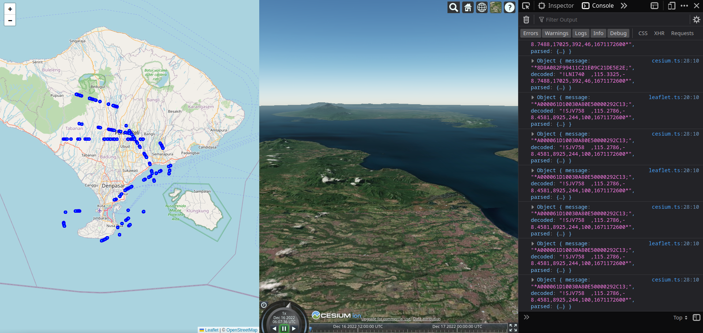

# flight-tracker-3d

Decodes ads-b packets received from a software defined radio such as the repurposed digital tv usb stick known as rtl-sdr and displays flight tracks.

Left pane shows the positions on a leaflet map. The right side shows a 3D rendered view from the pilot's perspective courtesy of cesiumjs.



## Usage

Start dump1090 to capture data from the usb radio. Requires docker.

```shell
npm run adsb
```

If you already have dump1090 software running the app will connect to it on localhost:30002. If located elsewhere copy `.env.example` to `.env` and change the port and host as required.

```shell
websocket_port=<your port>
websocket_host=<your host>
```

Sign up and acquire a cesium token here <https://cesium.com/ion/tokens>. Place the token in your `.env` file.

```shell
cesium_token=<your token>
```

Build the project.

```shell
npm install
npm run build
```

Serve.

```shell
# serve data over websocket
npm start
# serve webapp
npm run serve
```

# callbag-adsb

👜 A callbag source for dump1090

[callbag-adsb](https://www.npmjs.com/package/callbag-adsb) has been refactored out of this project and published to npm. Use this if you wish to build your own tracker.

```javascript
import adsbSource from 'callbag-adsb'
import observe from 'callbag-observe'

const messages = adsbSource()

observe(console.log)(messages)
```

```javascript
{
  message: '*8D40621D58C386435CC412692AD6;',
  decoded: '!,3.9389,52.2658,38000,0,0,1671779677*',
  parsed: {
    callsign: '',
    lon: 3.9389,
    lat: 52.2658,
    altitude: 38000,
    speed: 0,
    heading: 0,
    timestamp: 1671779677 // timestamp will be when message received. ads-b messages don't encode the timestamp
  }
}
```

# callbag-net

👜 A callbag source (client) for nodejs `net.Socket`

[callbag-net](https://www.npmjs.com/package/callbag-net) has also been refactored out of this project and published to npm.

You might find it useful for streaming nodejs [`net.Socket`](https://nodejs.org/api/net.html#class-netsocket) tcp or ipc connections:

"This class is an abstraction of a TCP socket or a streaming IPC endpoint (uses named pipes on Windows, and Unix domain sockets otherwise)."
